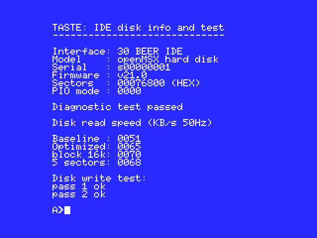
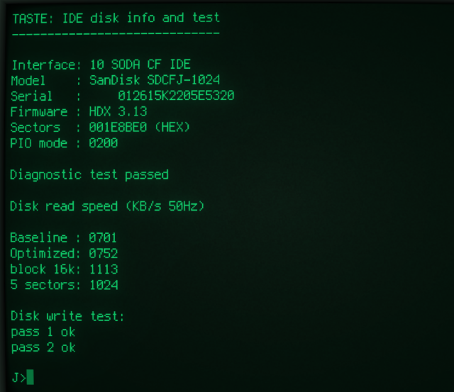

# TASTE

IDE disk info and test program for MSX and RomWBW CP/M.

The binary version can be loaded from MSX BASIC with the command:  
BLOAD "TASTE.BIN",R

The DOS version can be started from the MSX-DOS or RomWBW CP/M command prompt.

The usage on RomWBW CP/M is experimental. It should work with standard CF IDE and 8255 PPIDE interface cards on Z80 or Z180 rcbus computers. The RomWBW disk driver isn't used but the IDE hardware is directly accessed so it won't work with all RomWBW compatible hardware configurations.

It is required to have a master disk unit attached to the interface.

## Command line parameters

**Test options**
```
/X      Include block read test.
        Note: some disk controllers don't support multi sector read.

/W      Include write test.
        This test destroys the last 64KB of data on the harddisk!
        On large disks the last 64KB up to 8GB is used.

/D      Print debug information.
```

Multiple test options can be specified.

**Interface**
```
/B      BEER IDE (MSX)
/M      MALT | 8255 PPIDE
/S      SODA | CF IDE
```

If no interface is specified then the program will try to autodetect it.

## Output

**Information**

| Field           | Description                          |
|:----------------|:-------------------------------------|
| Interface       | Base i/o address and interface       |
| Model           | Disk media information               |
| Serial          | Disk serial number                   |
| Firmware        | Disk controller firmware             |
| Sectors         | Disk size (hex number of sectors)    |
| PIO mode        | Maximum supported PIO mode           |


**Diagnostic test**  
passed or failed with error code

**Disk read speed**  
Sequential disk read tests in KB/s, the 50Hz or 60Hz indicates what timer frequency is detected.

| Field           | Description                          |
|:----------------|:-------------------------------------|
| Baseline        | Baseline sector read routine         |
| Optimized       | Optimized routine (if available)     |
| block 16k       | Multi sector / block read 32 sectors |
| 5 sectors       | Multi sector / block read 5 sectors  |

**Disk write test**  
2 pass write test result

## Examples

MSX BEER IDE



RCBUS Z180 CF IDE


